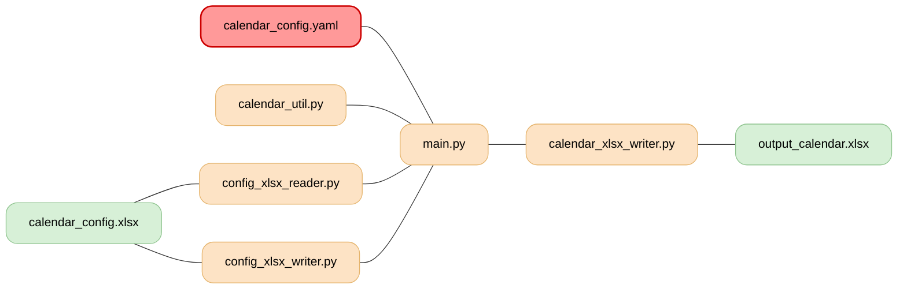
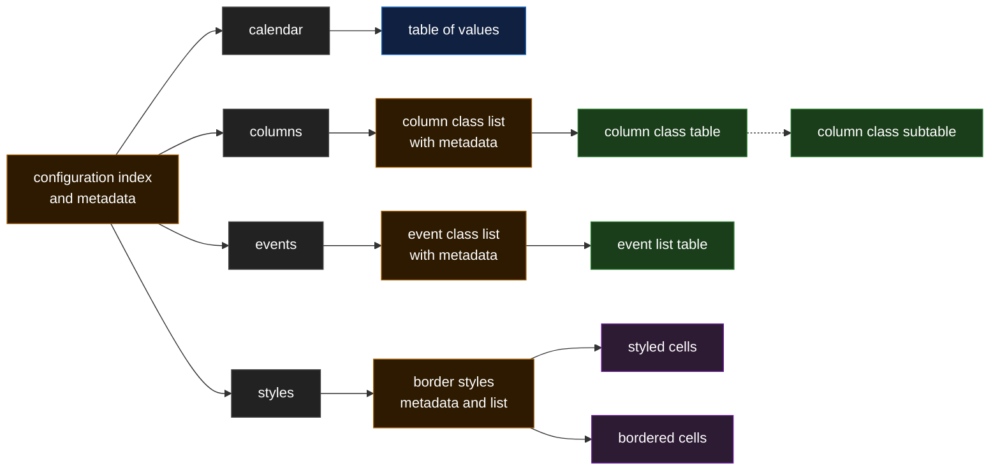

# coffee-salad

**A Pythonic Excel calendar generator**

A Python application to create a calendar in Microsoft Excel.

## Class structure

**[calendar_util.py](calendar_util.py):**
1. `CalendarUtility` - Handles logging and color management for the calendar package

**[config_xlsx_reader.py](config_xlsx_reader.py):**
1. `ConfigXlsxReaderError` - Base exception for ConfigXlsxReader errors
2. `MissingColumnError` - Exception for missing required columns
3. `InvalidTypeError` - Exception for invalid parameter types
4. `ConfigReferenceError` - Exception for empty config references
5. `ConfigXlsxReader` - Reads calendar configuration from Excel files

**[calendar_xlsx_writer.py](calendar_xlsx_writer.py):**
1. `CalendarXlsxCreatorError` - Exception class for xlsx creation errors
2. `calendarXlsxCreator` - Creates XLSX files from scratch

**[config_xlsx_writer.py](config_xlsx_writer.py):**
No classes defined (only module docstring)

**[main.py](main.py):** - fummy
No classes defined (only main function)

# config

- Script configuration is stored in a YAML file.
- Calendar configuration is stored in an `.xlsx` file {Calendar_template.xlsx} and details:
  - The calendar configuration, including start and end dates.
  - The calendar column structures.
  - The types of events entered into the calendar.
  - The actual events entered, including start/end dates and type.
  - The styles used in the calendar.

## Calendar config {Calendar_template.xlsx}

**structure**
(xlsx columns and rows)

- First row contains the column headers
- any empty rows are ignored, for readability only
- any rows starting with # in the first populated column can be considered empty and ignored
- columns that don't have a header are ignored

**Parsing the calendar config**

The .xlsx config file is parsed by the config_xlsx_reader information is stored in a dictionary for access

**columns**

Configuration columns are consistent across configuration worksheets:

Standard columns are: _type_, _param_, _value_, _description_, _note_, _ref_

_type_

- each parameter (row) is assigned a type, these are used to contextualise values and define the configuration structure. eg is the value an int, string, or link to a configuration.
- types are defined in the _meta-config_ config worksheet
- _meta-config_ type params provide the metadata for the proceeding configuration in the sheet
- _config_ type params provide a link to the next sub-configuration worksheet
- _meta_ types point to non-parse-able metadata sheets and should not be read
- _int_, string, date describe data types and how they should be parsed
- _list_ type indicates that the parameter is a list and the rest column header
- _style-cell_ uses the styles the value column (colour, bg, angle etc) for parsing style properties - borders are ignored, text is ignored.
- style-border uses the styles the value column borders for parsing the border style and sides - non-border styles are ignored, text is ignored.

_param_

- param column defines the parameters name
- when the value type is a list, the meta-config value will be used as the matrix/list/dictionary name

_value_

- in the meta-config the value column defines which columns to use as values
- single value parameters usually say 'value' in the sheets meta-config row, else a list of columns to consider the as a list (row) value
- trailing commers can be ignored

_other columns_

- unless specified in the value column, all other columns are meta and can be ignored
- meta columns (usually but not always) include description, notes, ref

**worksheets**

Worksheets are used to store individual configurations

- worksheet names must start with "config-"
- the "config-meta" sheet defines lists that may be used later.
- first non-meta worksheet is the starting index or "main config" sheet, usually called config-main
- from the main config, the configuration is mapped out in a tree structure linking to the other worksheets
- the "config-style" sheet defines the styles, both cell and cell borders. Use spaces between rows where practical  

meta-config

- the meta-config is usually the first row of values after the headers
- this row describes how to parse the proceeding information

config-styles

- the syles are stored as excel formatted styles, rather than textual descriptions
- styled cells are read in via the openpyxl: https://openpyxl.readthedocs.io/en/stable/styles.html

## Calendar_template structure

- calendar
- columns
- events
- styles

# Output Calendar

The generated calendar is output as a worksheet within an `.xlsx` file.
processing is performed by classes in the calendar_xlsx_writer.py module

## processing ##
Pseudocode:
- Read in configuration dictionary create supporting structures used to generate xlsx.
- create styles in xlsx
- create calendar framework
  - dates
  - style cells
- iterate events by 

supporting structures:
- to be added to the configuration
  - cell referece by date 
  - date refrence by cell
  - catagory index (row offeset)
  - stlye list - with created-in-xlsx flag
  - boarder style list

supporting functions:
- get_cell_by_date (date, {category})
- add_style (style, name)
- apply_style (cell, style)
- set_date_as_busy (date)
- save_xlsx
- create_worksheet
- event_is_multiday
- add_event (event config)

supporting globals:
- xlsx_name
- xlsx_path
- workbook