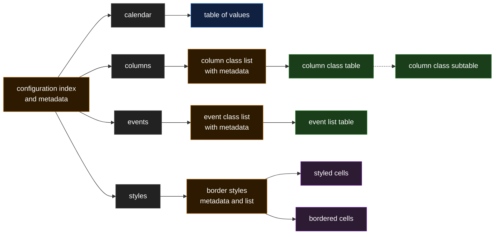

# coffee-salad

**Pythonic Excel calendar generator**

A Python application to create a calendar in Microsoft Excel.

- Script configuration is stored in a YAML file.
- Calendar configuration is stored in an `.xlsx` file and details:
  - The calendar configuration, including start and end dates.
  - The calendar column structures.
  - The types of events entered into the calendar.
  - The actual events entered, including start/end dates and type.
  - The styles used in the calendar.

## Calendar_template

columns and rows
- First row contains the column headders
- any empty rows are ignored, for readability only 
- any rows starting with # in the first populated column can be considered empty and ignored
- columns that don't have a header are ignored

types
- each parameter is asigned a type, these are used to contextualise values and define the configuration structure
- types are defined in the meta-config 
- meta-config type params provide the metadata for the proceeding configuration in the sheet
- config type params provide a link to the next sub-configuration worksheet
- meta types point to non-parsable metadata sheets and should not be read
- int,string,date describe data types and how they should be parsed
- list type indicates that the parapmeter is a list and will be read as a 2d dictionary

meta-config
- the metaconfig is usually the first row of values after the headers
- this row describes how to parse the proceeding information

param column
- param column defines the parameters name
- when the value type is a list, the meta-config value will be used as the matrix/list/dictionary name

type column
- each parameter is asigned a type, these are used to contextualise values and define the configuration structure
- types are defined in the meta-config 
- meta-config type params provide the metadata for the proceeding configuration in the sheet
- config type params provide a link to the next sub-configuration worksheet
- meta types point to non-parsable metadata sheets and should not be read
- int,string,date describe data types and how they should be parsed
- list type indicates that the parapmeter is a list and the restcolumn header
- style-cell uses the styles the value column (colour, bg, angle etc) for parsign style properties - borders are ignored
- style-border uses the styles the value column borders for parsign the border style and sides

value column
- in the meta-config the value column defines which columns to use as values
- single value parameters usually say 'value' in the sheets meta-config row, else a list of columns to consider the as a list (row) value
- trailing commers can be ignored

other columns
- unlsess specified in the value column, all other columns are meta and can be ignored
- meta columns (usually but not always) include description, notes, ref

Worksheets are used to store individual configurations
- worsheet names must start with "config-"
- the "config-meta" sheet defines lists that may be used later. it does not 
- first non-meta worksheet is the starting index or "main config" sheet, usualy called config-main
- from the main config, the condiguration is mapped out in a tree structure

## Calendar_template structure:

## outputted Calendar

The generated calendar is output as a worksheet within an `.xlsx` file.

## Classes

The application includes these main classes:

- `main`  
  Entry point for running the application.
- `calendar_creator`  
  Handles the creation and population of the calendar.
- `config_xlsx_reader`  
  Reads calendar structure, content, and styles from a configuration `.xlsx` file.
- `config_xlsx_writer`  
  Writes calendar structure, content, and styles to a configuration `.xlsx` file.
- `calendar_util`  
  Provides logging, script configuration loading, and utility functions.

